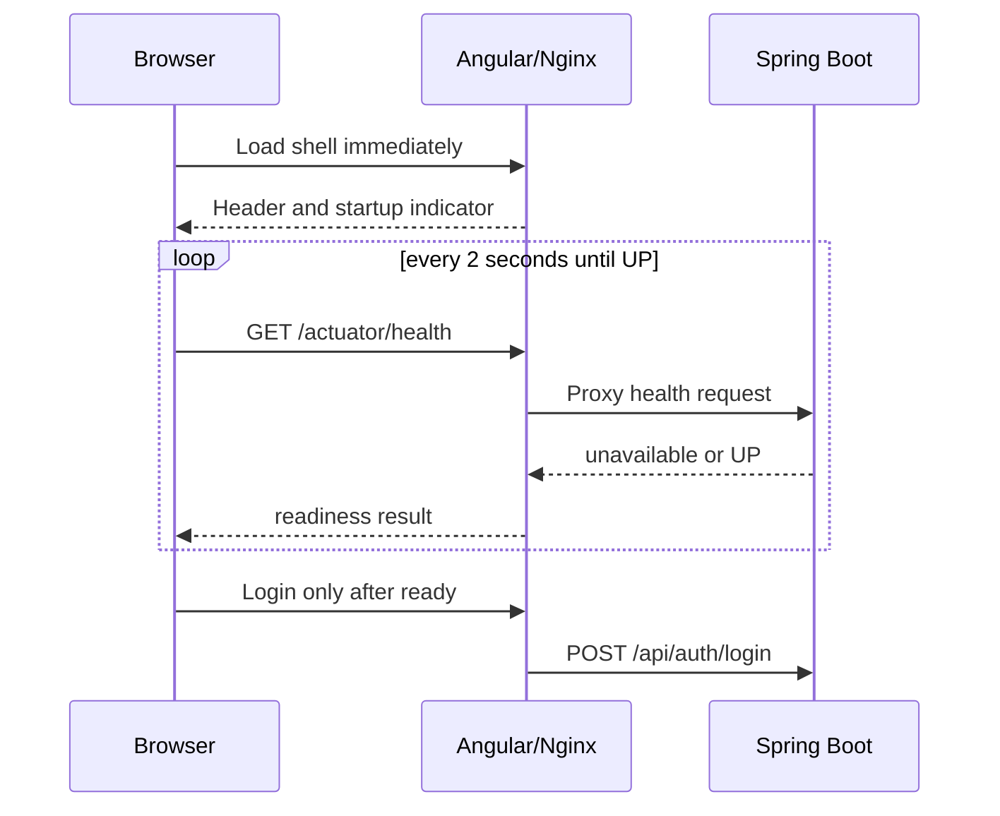

# Frontend backend-readiness specification

## Status

**IN PROGRESS — implementation and Compose evidence are complete; the focused
Karma browser-spec result is still inconclusive.**

## Outcome and boundaries

Docker Compose must make the Angular shell available without waiting for Spring
Boot health. While the backend is starting or temporarily unreachable, the UI
must visibly say so and prevent a login submission that is guaranteed to fail.

This feature does not alter product routes, login payloads, JWT handling,
backend authorization, or the existing `/api/**` contract. It reuses the
public Spring Actuator health endpoint through the same frontend origin.

## Design

`BackendReadinessService` is a root-provided Angular service with a signal. It
starts in `starting`, retries health requests every two seconds, and switches
to `ready` only for `{ "status": "UP" }`. The root component renders the
status indicator; the login component disables its submit button until ready.

## Delivery surfaces and acceptance scenarios

| Surface | Scenario | Evidence |
|---|---|---|
| Docker/runtime | The frontend container starts without waiting for the backend health check. Nginx proxies `/actuator/health` as well as `/api/`. | Rendered Compose configuration and isolated startup smoke. |
| Browser UI | On initial frontend load while health is unavailable, the header shows “Starting server…” and login submission is disabled. | Focused login component test. |
| Browser-to-API | Health polling retries after an unavailable response; when the endpoint returns `UP`, the indicator clears and login becomes enabled. | Readiness service test and Compose smoke. |
| API/contract | Existing `/api/**` requests and authentication payloads are unchanged. | Existing backend/controller tests and login smoke. |
| Realtime | N/A — this app has no realtime protocol. | Source inspection. |

## Verification

1. Run Angular type checks and the new focused readiness/login tests.
2. Run the production Angular build.
3. Render both Compose modes and prove the frontend responds before backend
   health, then prove health reaches `UP` and login works.
4. Run `git diff --check`.

## Completion evidence

- The isolated frontend returned the Angular shell while the backend container
  reported `health: starting`; its proxied health request returned `503`.
- The same health route then returned `UP`, and the existing same-origin login
  completed successfully.
- Angular application/spec type checks and the production image build completed.
  The focused Karma command ended after `Building…` without a browser/spec
  summary, so it remains inconclusive rather than passing evidence.
