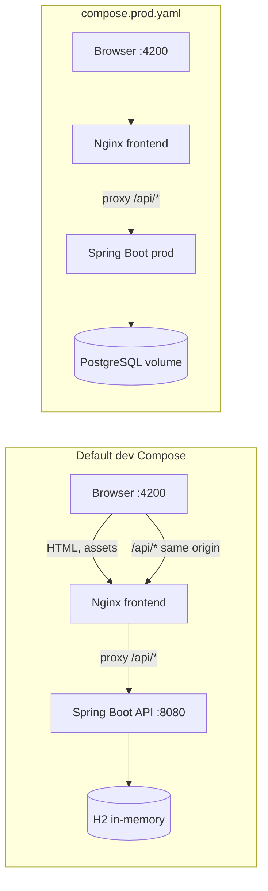

# Docker Compose local-stack specification

## Outcome and scope

`docker compose up --build` runs the existing Angular product manager and its
Spring Boot API locally. The browser loads the SPA from `http://localhost:4200`
and calls the unchanged `/api/*` routes through the same-origin Nginx proxy.

The default Compose file runs the `dev` H2 journey. Combining it with
`compose.prod.yaml` switches Spring to the PostgreSQL-backed `prod` journey;
it preserves product HTTP routes, JWT response shape, browser routing, and the
same-origin proxy. The production-like override creates a durable local volume.

## Build efficiency

Both Dockerfiles require BuildKit and keep dependency installation ahead of
application-source copies. Maven's local repository and npm's package cache
are BuildKit cache mounts, so a source-only rebuild reuses downloaded
dependencies. The backend runtime uses the smaller Alpine JRE image; it still
contains `curl` because the existing Compose health check requires it.

| Build scenario | Expected cache behavior | Evidence |
|---|---|---|
| Rebuild without changing dependency manifests | Maven/npm dependency layers are cached; only source compilation runs. | Two consecutive `docker compose --progress=plain build` runs show `CACHED` dependency-install steps on the second run. |
| Change `pom.xml` or a package manifest/lockfile | The corresponding dependency step is rerun; the other service can remain cached. | Build output identifies the affected service and dependency layer. |
| Run the optimized dev images | Existing ports, health check, Angular shell, H2 console, and same-origin login journey work. | `./scripts/verify-compose.sh`. |
| Run the optimized production-like images | Flyway creates schema, database-backed login works, and product data survives a backend restart. | `./scripts/verify-compose-prod.sh`. |

## Architecture

## Delivery surfaces and acceptance scenarios

| Surface | Scenario | Evidence |
|---|---|---|
| API/contract | Existing API remains reachable at `:8080`; `/actuator/health` is the readiness probe, while the H2 console remains dev-only. | Backend tests and both Compose health checks. |
| Browser UI | `GET :4200/` returns the Angular shell and supports client-side route fallback. | Compose smoke check finds `<app-root>` in the served document. |
| Browser-to-API journey | Dev login uses `admin/admin123`; production-like login uses the database bootstrap user, then a created product survives a backend restart. | Dev and PostgreSQL Compose smoke scripts. |
| Realtime behavior | N/A: this application has no realtime protocol or client. | Source inspection; no Socket.IO/WebSocket dependency exists. |

## Assumptions and recovery

- `.env` is local-only and supplies JWT, database, and bootstrap values;
  `.env.example` is deliberately non-production placeholder material.
- H2 data resets after a backend restart by existing application design. No
  Docker volume should be deleted to recover this stack.
- The PostgreSQL volume survives ordinary `docker compose down`; never use
  `down -v` unless intentionally discarding local production-like data.
- If the host ports are occupied, stop the verified local process or change the
  host side of the Compose port mapping; container ports remain `4200` (web
  host mapping) and `8080` (API).

## Verification

Run `./scripts/verify-compose.sh` for the H2 dev journey and
`./scripts/verify-compose-prod.sh` for PostgreSQL persistence. Each validates
the rendered Compose file, starts the required services, and uses the browser
origin for API checks. Both run `docker compose down --remove-orphans` on exit
and do not remove volumes.
