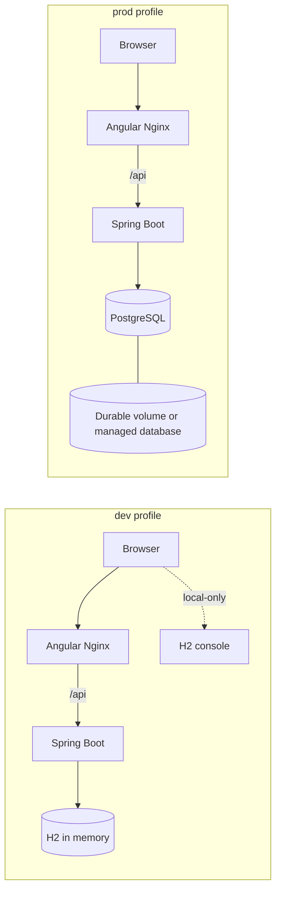

# Development H2 and production PostgreSQL plan

## Status

**PLANNED — no runtime configuration has changed.** This plan keeps the current
local developer experience while defining a safe path to durable PostgreSQL
application state. Implementation requires approval of the decisions called out
below, especially the production authentication policy and schema-migration
authority.

## Goal and boundaries

| Profile | Intended use | Database | Persistence | Console |
|---|---|---|---|---|
| `dev` | Local development and fast feedback | in-memory H2 | Reset on application restart | H2 console enabled locally |
| `prod` | Production-like and deployed runtime | PostgreSQL | Named/managed durable storage | H2 console absent |

The product HTTP API (`/api/**`), Angular routes, JWT response shape, and the
same-origin frontend proxy remain unchanged. This is not a production release,
an authentication redesign, a TLS/secret-manager rollout, or a data migration
from the disposable current H2 database.

## Target deployment shape

`prod` must not expose the H2 console or retain its security exception. A
production readiness/health probe must not depend on an H2-specific route.

## Decisions required before implementation

| Decision | Recommended direction | Why it needs an explicit decision |
|---|---|---|
| Schema authority | Use Flyway migrations for PostgreSQL; do not use Hibernate `update` as the production migration process. | Establishes how future database changes are authored, reviewed, and recovered. |
| Production authentication | Disable the current demo in-memory user in `prod`; choose a separate approved production identity design. | Keeping demo credentials is an authorization-policy decision, not a database configuration detail. |
| Compose production shape | Keep `compose.yaml` as the existing dev journey and add an explicit production override (for example `compose.prod.yaml`) that provisions PostgreSQL. | Prevents an accidental switch of normal local development to durable state and makes production intent visible. |
| Health endpoint | Add a narrowly exposed, authenticated-safe health endpoint/probe for `prod` rather than probing `/h2-console/`. | Adds an HTTP surface and security rule. |
| PostgreSQL lifecycle | Decide whether the Compose named volume is only a local production-like aid or deployment uses a managed PostgreSQL service. | Determines backup, access, ownership, and recovery responsibilities. |

Until the authentication decision is made, the production browser login journey
cannot be marked complete. It would be misleading to call a runtime with a
hard-coded demo account a production mode.

## Work packages

### 1. Profile configuration and safe startup

- Split common, `dev`, and `prod` settings into profile-specific Spring
  configuration.
- Keep H2 and its console only in `dev`; make `prod` require PostgreSQL URL,
  username, password, and JWT secret through environment configuration.
- Scope the sample-product seed runner to `dev`; do not seed a production
  database automatically.
- Remove the `/h2-console/**` authorization and frame exception from `prod`.
- Add fail-fast configuration validation so an incomplete `prod` environment
  does not silently fall back to H2.

### 2. Durable schema and repository compatibility

- Add the PostgreSQL JDBC runtime dependency and the approved migration tool.
- Establish the initial PostgreSQL schema as a versioned migration matching the
  current product model and constraints.
- Test product creation, validation errors, pagination, and case-insensitive
  search against PostgreSQL. In particular, verify search/collation behavior
  rather than assuming H2 and PostgreSQL are identical.
- Treat the existing in-memory H2 data as disposable: PostgreSQL starts with a
  controlled empty schema (and only approved bootstrap data), not an automatic
  copy of sample products.

### 3. Containers, probes, and documentation

- Preserve the existing local `docker compose up --build` dev experience.
- Add the selected explicit production Compose invocation with PostgreSQL,
  required environment variables, a durable named volume, and a database-aware
  readiness dependency.
- Replace the H2-console health check for production with the approved health
  probe.
- Update `README.md`, `docs/docker-compose.md`, `.env.example`, and
  `scripts/verify-compose.sh` with separate dev and production-like commands.
- Retain the current Docker dependency-cache design: profile configuration
  changes must not broaden build contexts or undo manifest-first cache layers.

## Delivery surfaces and acceptance evidence

| Surface | Acceptance scenarios | Evidence required |
|---|---|---|
| API and configuration | `dev` starts with H2; `prod` starts only with complete PostgreSQL settings; H2 console is unavailable in `prod`; product API paths and validation responses retain their contract. | Profile-specific Spring context/configuration tests, controller tests, and a PostgreSQL-backed integration test. |
| Browser UI | Existing login, list, search, create, update, and validation feedback behave unchanged in both supported journeys. A recoverable backend/database failure is shown through the existing error path rather than silently losing form data. | Test-first Angular component coverage for any changed error state plus browser smoke coverage. |
| Browser-to-API | From the frontend origin, a user can authenticate using the approved identity method, create a product, restart only the backend, reload, and still see that product in the PostgreSQL journey. The dev journey remains functional with its intentional reset behavior. | Separate automated dev and production-like Compose smoke scripts; production-like run proves persistence across backend restart. |
| Realtime | N/A — this application has no realtime protocol or Socket.IO surface. | Confirm no realtime client/server configuration is introduced. |
| Operations and recovery | Ordinary shutdown preserves PostgreSQL data; documentation warns that `docker compose down -v` destroys the local volume. Missing production secrets/configuration fail safely. | Compose config validation, cold and repeated cached image builds, restart/persistence smoke, and documented recovery behavior. |

## Verification sequence

1. Run backend unit/controller/configuration tests, including a `dev` context
   and negative `prod` configuration case.
2. Run PostgreSQL integration tests using the approved test strategy
   (recommended: Testcontainers) and verify migrations from an empty database.
3. Run Angular type checks, component tests affected by any UI error handling,
   and a production build.
4. Run both Compose smoke journeys: the default H2 dev route and the explicit
   PostgreSQL route. The latter must prove product persistence after a backend
   restart without deleting the database volume.
5. Verify a cold Docker build and an unchanged repeated BuildKit-cached build;
   report cache hits separately from image-size measurements.
6. Run `git diff --check` and update the roadmap evidence only after all
   applicable rows are green.

## Implementation exit criteria

This plan may move to `DONE` only when the approved production identity and
schema choices are implemented, PostgreSQL persistence is proven through the
browser-to-API journey, dev H2 behavior remains explicitly tested, and the
documentation supplies reproducible commands for both modes.
